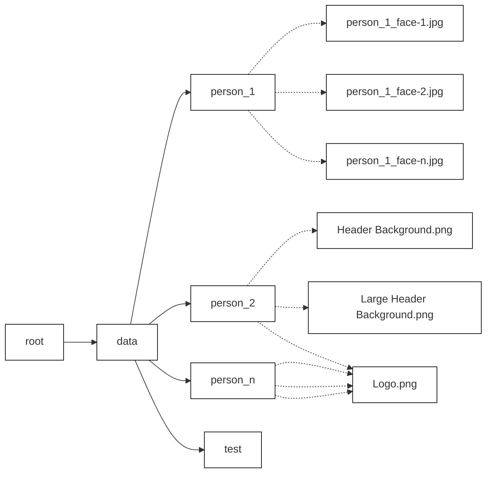

# face_voice_recognition
## introduction
This project is for classifying the face in a group. It can be used to manage the photo in 
the family, recognize employees in a company, etc. It will process in this procedure.
1. collect the person’s facial pictures and sort it in specific file structure.
2. the model in dlib will turn every picture in training set into an 128D vector

## require
- python 3.10
- dlib gpu
- cuda + cudnn

## turn face into 128 dimensions vector
use face_descript_compute.py to compute dacial description


## File structure  
- root
  - data/
    - person_1/
      - person_1_face-1.jpg
      - person_1_face-2.jpg
      - ...
      - person_1_face-n.jpg
    - person_2/
      - person_2_face-1.jpg
      - person_2_face-2.jpg
      - ...
      - person_2_face-n.jpg
    - ...
    - person_n/
      - person_n_face-1.jpg
      - person_n_face-2.jpg
      - ...
      - person_n_face-n.jpg
  - test/
    - file1.jpg
    - file2.jpg



```
project
│   README.md
│   file001.txt    
│
└───folder1
│   │   file011.txt
│   │   file012.txt
│   │
│   └───subfolder1
│       │   file111.txt
│       │   file112.txt
│       │   ...
│   
└───folder2
    │   file021.txt
    │   file022.txt
```
---------------------------
## Issue
1. Face Recognition Model Accuracy:
The face_recognition model does not provide sufficient accuracy. In contrast, the cnn_face_detection_model_v1 in dlib, while more accurate, is less efficient.
2. Model Tuning:
There is a need to fine-tune the classification model to enhance its performance and accuracy.
