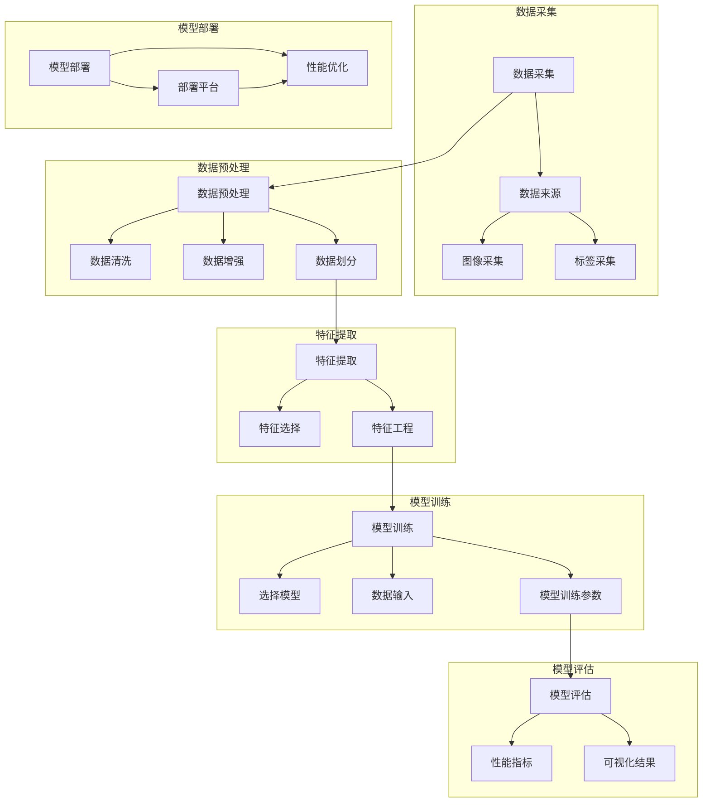

```mermaid
graph TD
  subgraph 数据采集
    A[数据采集] --> B[数据来源]
    B --> C[图像采集]
    B --> D[标签采集]
  end

  subgraph 数据预处理
    E[数据预处理] --> F[数据清洗]
    E --> G[数据增强]
    E --> H[数据划分]
  end

  subgraph 特征提取
    I[特征提取] --> J[特征选择]
    I --> K[特征工程]
  end

  subgraph 模型训练
    L[模型训练] --> M[选择模型]
    L --> N[数据输入]
    L --> O[模型训练参数]
  end

  subgraph 模型评估
    P[模型评估] --> Q[性能指标]
    P --> R[可视化结果]
  end

  subgraph 模型部署
    S[模型部署] --> T[部署平台]
    S --> U[性能优化]
  end

  A --> E
  H --> I
  K --> L
  O --> P
  T --> U


```

