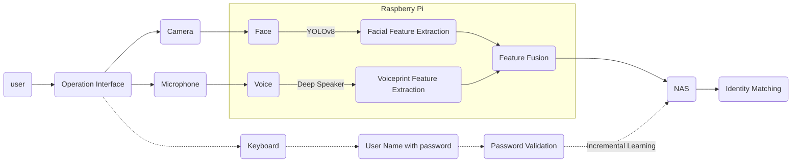

```mermaid
%%{
  init: {
    "theme": "base",
    "themeVariables": {
      "darkMode": "false",  // 更改為 false
      "background": "#fff", // 更改為白色
      "primaryColor": "#233B48",
      "primaryTextColor": "#fff",
      "primaryBorderColor": "#ADC6CD",
      "lineColor": "#ADC6CD",
      "secondaryColor": "#ADC6CD",
      "tertiaryColor": "#1C1C1C"
    }
  }
}%%
flowchart LR
input(user)-->OS(Operation Interface)
OS --> Image(Camera)
OS --> Voice(Microphone)
OS .-> Keyboard(Keyboard)
Image --> Face(Face)
Voice --> Speak(Voice)
Keyboard .->LOG(User Name with password)
subgraph Raspberry Pi
Face --> |YOLOv8| FFE(Facial Feature Extraction)
Speak --> |Deep Speaker|VFE(Voiceprint Feature Extraction)
FFE --> FF(Feature Fusion)
VFE --> FF
end
FF --> NAS(NAS)
LOG .-> PV
PV(Password Validation) .-> |Incremental Learning| NAS
NAS --> IM(Identity Matching)

```

